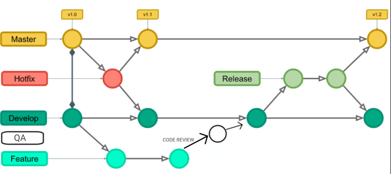

# Curso de React: desenvolvendo com JavaScript

Neste repositório apresento a aplicação de nome "Organo", que permite o cadastro e a exibição de um organograma de uma empresa, permitindo que pessoas sejam incluídas em times.

Esta aplicação foi desenvolvida no "Curso de React: desenvolvendo com JavaScript" da plataforma Alura.
- Neste curso:
  - Iniciei o aprendizado e a aplicação dos conceitos relacionados ao universo do React:
    - Componentes
    - "<React.StrictMode>"
    - "reportWebVitals"
    - "...Tests"
  - Analisei a estrutura de um projeto React:
    - index: porta de entrada da aplicação
    - package.json: contém as versões das bibliotecas utilizadas
    - app.json: apresenta as configurações do Expo para o aplicativo que está sendo trabalhado
    - /node_modules: contém os arquivos das bibliotecas definidas em "package.json"
    - /public: contém arquivos estáticos utilizados na solução

---

# Ferramentas, Recursos e Processos Utilizados
- IDE: [Visual Studio Code](https://code.visualstudio.com/)
- Node: [Node.js v20.14.0](https://nodejs.org/en)
- Node Version Manager: [NVM](https://github.com/nvm-sh/nvm?tab=readme-ov-file#node-version-manager---)
  - Windows Subsytem for Linux: [WSL](https://learn.microsoft.com/pt-br/windows/wsl/install)
- Markdown + Visual Studio Code: [Markdown](https://code.visualstudio.com/docs/languages/markdown)
- Git Flow: Todos os conteúdos gerados neste repositório estão seguindo o modelo de fluxo de trabalho baseado no "Git Flow", conforme:

---

# Base de Conhecimento
## Dicas
- "./" quer dizer "a partir de onde eu estou"

## Conceitos
- npx: Gerenciador de pacotes do node para recursos REMOTOS
- npm: Gerenciador de pacotes do node para recursos LOCAIS

## Comandos Utilizados
### Preparação do Ambiente
- wsl --install
  - Para ativar o WSL no Windows
- curl -o- https://raw.githubusercontent.com/nvm-sh/nvm/v0.35.3/install.sh | bash
  - Para baixar o NVM (Node Version Manager)
- nvm ls-remote
  - Para listar as versões disponíveis para download do Node
- nvm install v20.14.0
  - Para instalar esta versão específica do Node
- nvm use 20.14.0
  - Para usar esta versão específica do Node
- nvm ls
  - Para listar as versões instaladas do Node
- node -v
  - Para verificar a versão do node que está sendo utilizada
- npm install -g expo-cli
  - Para instalar o Expo no Windows
  - OBS: este comando está desatualizado, pois as novas versões do Expo utilizam a abordagem Local com "NPX", sem a necessidade de instalar o mesmo globalmente
- expo --version
  - Para verificar a versão do Expo instalada no computador
  - OBS: este comando está desatualizado, pois as novas versões do Expo utilizam a abordagem Local com "NPX", sem a necessidade de instalar o mesmo globalmente

### Navegação no Terminal
- cd <nome_pasta>
  - Para acessar uma subpasta em relação a pasta atual
- ls
  - Lista todos os itens dentro da pasta atual
- cls
  - Para limpar o terminal

### React
- npx create-react-app <nome_projeto>
  - Para criar o projeto React com um template padrão de organização de código e recursos
- npm start
  - Para executar/rodar a aplicação criada

---

# Links Úteis
- Documentação do [React](https://react.dev/reference/react)
- Design elaborado no [Figma](https://www.figma.com/design/T6BLI1HfB81eYOiVgpqQz7/Projeto-Intro-ao-React?node-id=134-128)